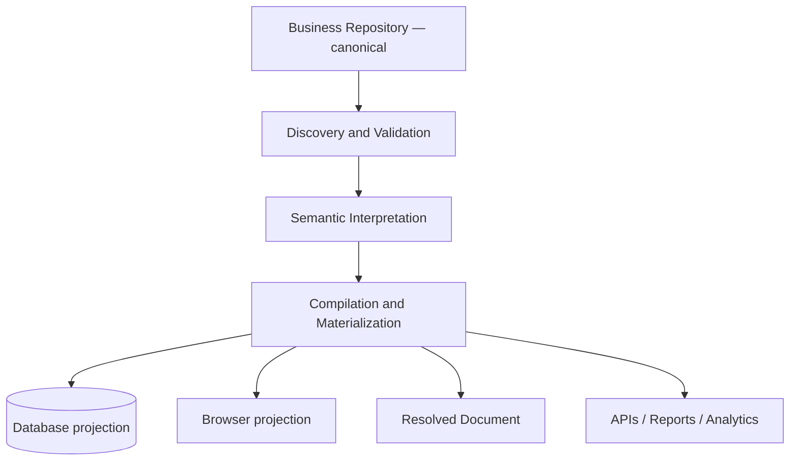
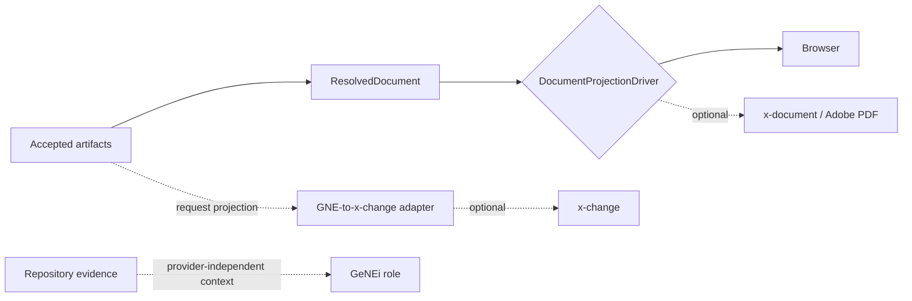

# GNE Architecture

GNE is a standalone Laravel control plane around a repository-native compiler. Dependency direction is commands/controllers and infrastructure → domain services and values → repository evidence. Domain primitives have no Eloquent dependency.

`business/` contains accepted source. `app/` discovers, validates, interprets, compiles, and materializes. `.gne/` contains disposable indexes, caches, projections, and reports. Runtime sessions, queues, locks, OTPs, and temporary tokens are operational state. Git provides provenance and review.

Discovery reads `gne.yaml` without a database, validates safe paths, inventories profiles, scenarios, and artifacts, and emits findings. Semantic indexing writes deterministic evidence-linked JSON. Materialization replaces projection rows transactionally and records a fingerprinted run. Rebuild deletes only disposable semantic output and projection rows after confirmation. Failures leave canonical files untouched.

Accepted artifacts are immutable and use stable repository identifiers plus revisions. Numeric IDs are implementation details. Canonical removal is reflected by projection replacement without erasing Git history.

## Integration seams

Browser and PDF are peer projections. GNE knows no Adobe details; future x-document consumes `ResolvedDocument`. Settlement remains outside core and x-change optional. GeNEi may use different engines and must cite evidence.

Laravel authentication protects the control plane. Public ceremonies may later use signed links, OTP, or transaction credentials without accounts. Organization, Repository, Membership, Role, and Authority need deliberate future modeling; generic teams are not enabled.
