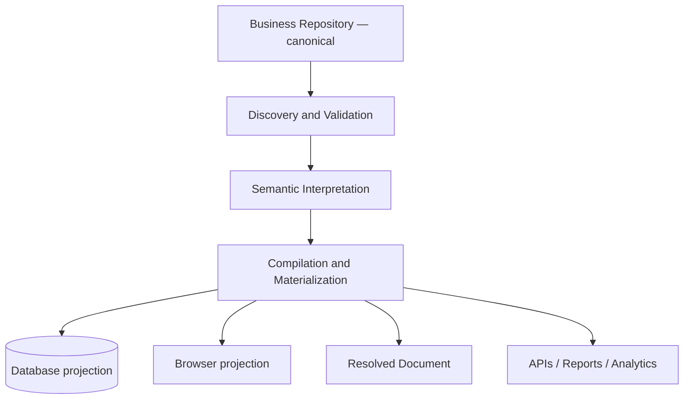
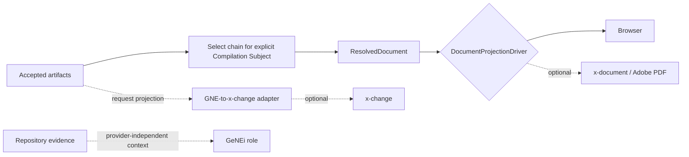
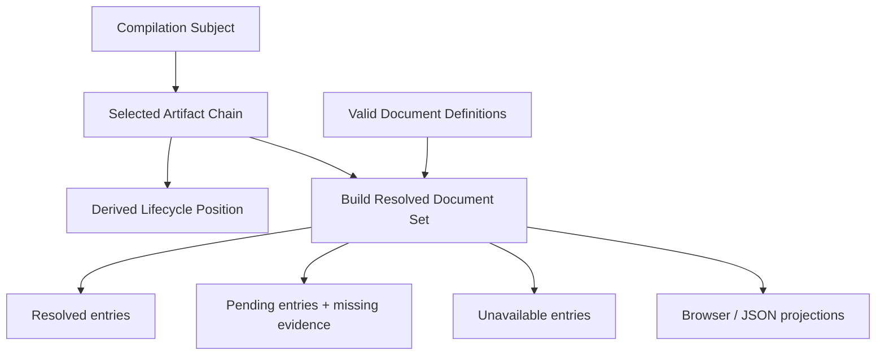

# GNE Architecture

GNE is a standalone Laravel control plane around a repository-native compiler. Dependency direction is commands/controllers and infrastructure → domain services and values → repository evidence. Domain primitives have no Eloquent dependency.

`business/` contains accepted source. `app/` discovers, validates, interprets, compiles, and materializes. `.gne/` contains disposable indexes, caches, projections, and reports. Runtime sessions, queues, locks, OTPs, and temporary tokens are operational state. Git provides provenance and review.

Discovery reads `gne.yaml` without a database, validates safe paths, inventories profiles, scenarios, and artifacts, and emits findings. Semantic indexing writes deterministic evidence-linked JSON. Materialization replaces projection rows transactionally and records a fingerprinted run. Rebuild deletes only disposable semantic output and projection rows after confirmation. Failures leave canonical files untouched.

Every evidence path is normalized relative to the repository root supplied to discovery; the Laravel application root has no special meaning. Profiles declare their vocabulary, lifecycles, scenarios, policies, documents, and schemas, and validation resolves those declarations without imposing example-specific filenames. The canonical repository fingerprint hashes each ordered relative path together with its raw bytes for `gne.yaml`, `GENEI.md`, and every non-placeholder file under the configured business path.

Accepted artifacts are immutable and use stable repository identifiers plus revisions. Numeric IDs are implementation details. Canonical removal is reflected by projection replacement without erasing Git history.

## Integration seams

Browser and PDF are peer projections. GNE knows no Adobe details; future x-document consumes `ResolvedDocument`. Settlement remains outside core and x-change optional. GeNEi may use different engines and must cite evidence.

## Resolved document intermediate representation

Repository-authored document definitions declare contributing artifact types, a primary artifact, audience, ordered semantic sections, fields, actions, and attachments. `SelectArtifactChain` first selects latest accepted revisions by artifact identity inside one explicit Compilation Subject and rejects incompatible or cross-subject evidence. `ResolveDocument` only interprets that selected chain, resolves declared payload paths, and emits an immutable `ResolvedDocument`. Each resolved field carries its artifact identifier, artifact revision, source path, and value path.

Profile defines business language; scenario defines a ceremony; Compilation Subject identifies one bounded business case; Artifact Chain contains its coherent accepted evidence. No resolver may substitute profile plus scenario for transaction identity. Ambiguous same-type identities fail instead of being selected by filesystem order.

## Authoring validation

`ValidateRepository` orchestrates discovery findings, accepted-payload validation, and document-definition validation, then deterministically orders structured findings. Business profiles own explicit artifact-type-to-schema mappings and their JSON Schema 2020-12 files. GNE owns `resources/gne/schemas/document-definition.schema.json`, because document grammar is compiler language rather than profile vocabulary. Opis JSON Schema performs standards validation; contextual rules check unique identities, declared types, scenario ownership, primary artifacts, and schema-backed `payload.*` field paths. Errors block compilation; readiness warnings do not.

`RepositorySourceLoader` converts only expected missing, malformed JSON, and malformed YAML source failures into `RepositorySourceException`. Validators catch that dedicated authoring exception and Opis `SchemaException` only at the operations that parse authored schemas. They do not catch `Throwable`: type errors, logic errors, and unexpected dependency failures propagate as compiler defects. A document that fails formal grammar receives grammar findings only; contextual rules run only after its structure is valid.

The primary artifact anchors the document but does not define its identity alone. Resolution hashes the document-definition identifier, revision, and raw source fingerprint together with the deterministically ordered selected artifact identifiers, revisions, types, source paths, and raw source fingerprints. The resolved identifier derives from this resolution fingerprint. The same direct inputs produce the same identity; changing any selected revision or source bytes changes it; unrelated repository changes do not.

## Resolved document set and lifecycle inventory

`BuildResolvedDocumentSet` selects one subject's coherent chain, evaluates every valid document definition owned by that profile and scenario through the existing `ResolveDocument`, and emits a driver-neutral inventory. Successful resolution is `resolved`; directly required but absent accepted evidence is `pending`. `Unavailable` is reserved for a future explicit, trustworthy restriction. Ambiguous artifact selection and cross-subject contamination are evidence-integrity failures and propagate instead of becoming inventory entries. The `not_applicable` state is reserved for future explicit applicability declarations and is not inferred.

Lifecycle position is read from the scenario's declared lifecycle and compared with accepted artifact types in the selected chain. The highest contiguous evidenced stage is current, the first missing stage is next, and later evidence beyond that absence is reported as a gap. This is an explanation of repository evidence, not a state machine. Set identity hashes only the subject, selected evidence, applicable definition sources, lifecycle source and resulting statuses; unrelated repository changes cannot alter it.

Missing-evidence reporting currently reflects the first unresolved direct source encountered by `ResolveDocument`. Aggregating every absent direct source is deferred. This limitation does not permit ambiguous or contaminated evidence to enter the normal inventory.

`ResolvedDocument` is the compiler intermediate representation: it contains business meaning but no HTML, Vue, Inertia, Tailwind, browser layout, PDF, or Adobe concepts. `BrowserProjectionDriver` maps that IR into a disposable structural browser projection without evaluating fields or adding business meaning. Future browser, PDF, Markdown, JSON, API, and mobile drivers are peers over the same IR.

Compilation planning reports expected `DocumentResolutionException` failures as unresolved definitions. Missing definitions are HTTP 404, while existing definitions lacking acceptable evidence are HTTP 422. Parser defects, infrastructure failures, type errors, and other unexpected exceptions propagate rather than being normalized into compilation results.

Laravel authentication protects the control plane. Public ceremonies may later use signed links, OTP, or transaction credentials without accounts. Organization, Repository, Membership, Role, and Authority need deliberate future modeling; generic teams are not enabled.
